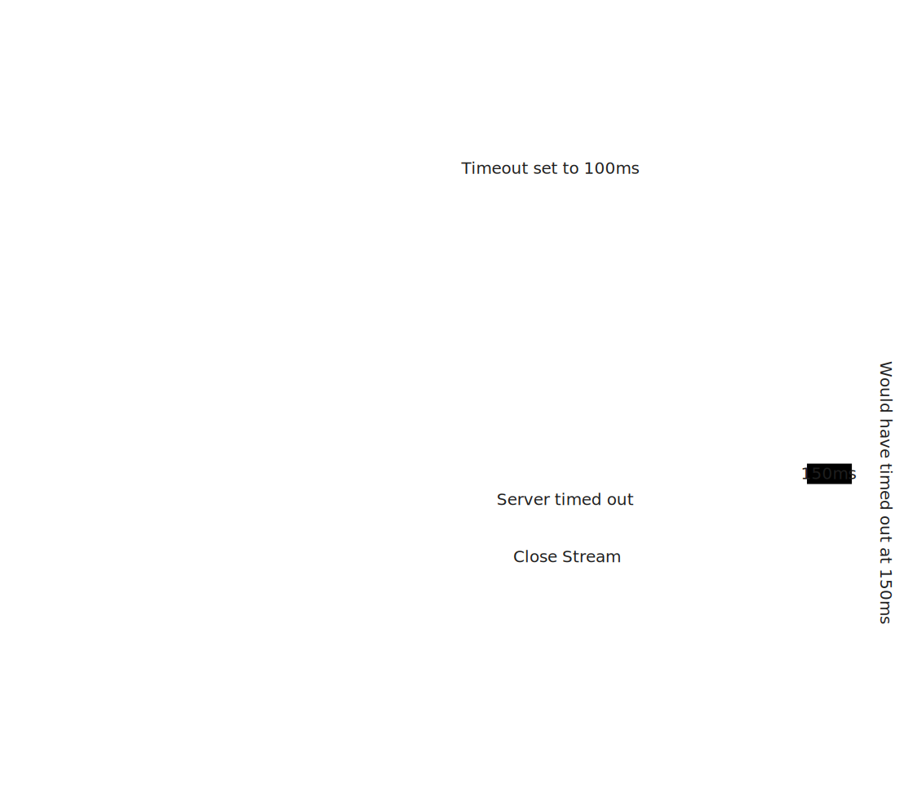
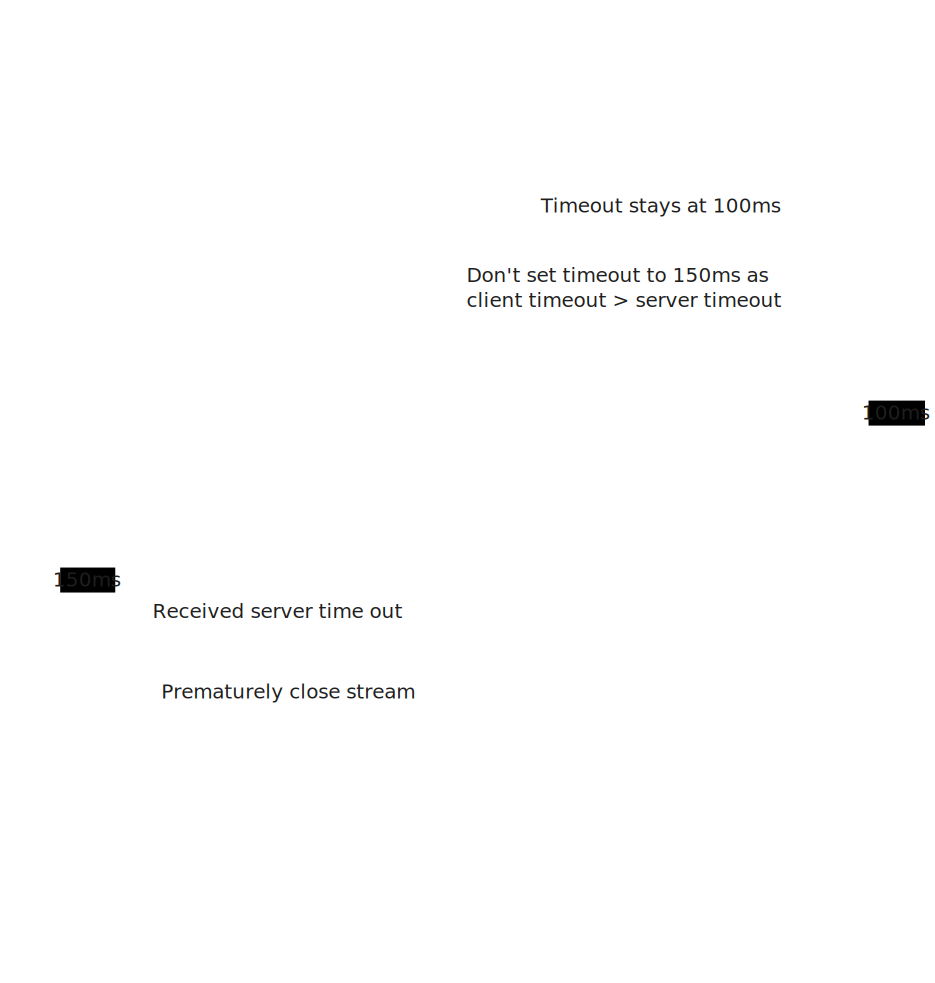

# js-rpc

staging:[](https://gitlab.com/MatrixAI/open-source/js-rpc/commits/staging)
master:[](https://gitlab.com/MatrixAI/open-source/js-rpc/commits/master)

## Installation

```sh
npm install --save @matrixai/rpc
```

## Usage

### Basic Usage

Because decorators are experimental, you must enable:
`"experimentalDecorators": true` in your `tsconfig.json` to use this library.

First, setup an `RPCStream` to use:

```ts
const rpcStream = {
  readable: new ReadableStream(),
  writable: new WritableStream(),
  cancel: () => {};
};
```

#### Server

```ts
import type { JSONRPCParams, JSONRPCResult, JSONValue } from "@matrixai/rpc";
import { RPCServer, UnaryHandler } from "@matrixai/rpc";

// Create a Handler
class SquaredNumberUnary extends UnaryHandler<ContainerType, JSONRPCParams<{ value: number }>, JSONRPCResult<{ value: number }>> {
  public handle = async (
    input: JSONRPCParams<{ value: number }>,
    cancel: (reason?: any) => void,
    meta: Record<string, JSONValue> | undefined,
    ctx: ContextTimed,
  ): Promise<JSONRPCResult<{ value: number }>> => {
    return input.value**2;
  };
}

const rpcServer = new RPCServer();

await rpcServer.start({
  manifest: {
    SquaredDuplex: new SquaredDuplex(),
    // ... add more handlers here
  },
});

rpcServer.handleStream(rpcStream);
```

#### Client

```ts
import type { HandlerTypes } from "@matrixai/rpc";
import { RPCClient, UnaryCaller } from "@matrixai/rpc";

// Get the CallerTypes of the handler
type CallerTypes = HandlerTypes<SquaredNumberUnary>;
const squaredNumber = new UnaryCaller<
  CallerTypes['input'],
  CallerTypes['output']
>();

const rpcClient = new RPCClient({
  manifest: {
    squaredNumber,
    // ... add more here
  },
  streamFactory: async () => rpcStream,
});

await rpcClient.methods.squaredNumber({ value: 2 });
// returns { value: 4 }
```

Any of the callers or handlers can be added from the below `Call Types` section.

### Call Types

#### Unary

In Unary calls, the client sends a single request to the server and receives a single response back, much like a regular async function call.

##### Handler

```ts
import type { JSONRPCParams, JSONRPCResult, JSONValue } from "@matrixai/rpc";
import { UnaryHandler } from "@matrixai/rpc";
class SquaredNumberUnary extends UnaryHandler<ContainerType, JSONRPCParams<{ value: number }>, JSONRPCResult<{ value: number }>> {
  public handle = async (
    input: JSONRPCParams<{ value: number }>,
    cancel: (reason?: any) => void,
    meta: Record<string, JSONValue> | undefined,
    ctx: ContextTimed,
  ): Promise<JSONRPCResult<{ value: number }>> => {
    return input.value**2;
  };
}
```

##### Caller

```ts
import type { HandlerTypes } from "@matrixai/rpc";
import { UnaryCaller } from "@matrixai/rpc";
type CallerTypes = HandlerTypes<SquaredNumberUnary>;
const squaredNumber = new UnaryCaller<
  CallerTypes['input'],
  CallerTypes['output']
>();
```

##### Call-Site

The client initiates a unary RPC call by invoking a method that returns a promise. It passes the required input parameters as arguments to the method. The client then waits for the promise to resolve, receiving the output.

``` ts
await rpcClient.methods.squaredNumber({ value: 3 });
// returns { value: 9 }
```

#### Client Streaming

In Client Streaming calls, the client can write multiple messages to a single stream, while the server reads from that stream and then returns a single response. This pattern is useful when the client needs to send a sequence of data to the server, after which the server processes the data and replies with a single result. This pattern is good for scenarios like file uploads.

##### Handler

On the server side, the handle function is an asynchronous function that takes an AsyncIterableIterator as input, representing the stream of incoming messages from the client. It returns a promise that resolves to the output that will be sent back to the client.

```ts
import type { JSONRPCParams, JSONRPCResult, JSONValue } from "@matrixai/rpc";
import { ClientHandler } from "@matrixai/rpc";
class AccumulateClient extends ClientHandler<ContainerType, JSONRPCParams<{ value: number }>, JSONRPCResult<{ value: number }>> {
  public handle = async (
    input: AsyncIterableIterator<JSONRPCParams<{ value: number }>>,
    cancel: (reason?: any) => void,
    meta: Record<string, JSONValue> | undefined,
    ctx: ContextTimed,
  ): Promise<JSONRPCResult<{ value: number }>> => {
    let acc = 0;
    for await (const number of input) {
      acc += number.value;
    }
    return { value: acc };
  };
}
```

##### Caller

```ts
import type { HandlerTypes } from "@matrixai/rpc";
import { ClientCaller } from "@matrixai/rpc";
type CallerTypes = HandlerTypes<AccumulateClient>;
const accumulate = new ClientCaller<
  CallerTypes['input'],
  CallerTypes['output']
>();
```

##### Call-Site

The client initiates a client streaming RPC call using a method that returns a writable stream and a promise. The client writes to the writable stream and awaits the output promise to get the response.

```ts
const { output, writable } = await rpcClient.methods.accumulate();
const writer = writabe.getWriter();
await writer.write({ value: 1 });
await writer.write({ value: 2 });
await writer.write({ value: 3 });
await writer.write({ value: 4 });
await writer.close();
await output;
// output resolves to { value: 10 }
```

#### Server Streaming

In Server Streaming calls,
the client sends a single request and receives multiple responses in a read-only stream from the server.
The server can keep pushing messages as long as it needs, allowing real-time updates from the server to the client.
This is useful for things like monitoring,
where the server needs to update the client in real-time based on events or data changes.
In this example, the client sends a number and the server responds with the squares of all numbers up to that number.

##### Handler

On the server side, the handle function is an asynchronous generator function that takes a single input parameter from the client. It yields multiple messages that will be sent back to the client through the readable stream.

```ts
import type { JSONRPCParams, JSONRPCResult, JSONValue } from "@matrixai/rpc";
import { ServerHandler } from "@matrixai/rpc";
class CountServer extends ServerHandler<ContainerType, JSONRPCParams<{ value: number }>, JSONRPCResult<{ value: number }>> {
  public handle = async function* (
    input: JSONRPCParams<{ value: number }>,
    cancel: (reason?: any) => void,
    meta: Record<string, JSONValue> | undefined,
    ctx: ContextTimed,
  ): AsyncIterableIterator<JSONRPCResult<{ value: number }>> {
    for (let i = input.number; i < input.number + 5; i++) {
      yield { value: i };
    }
  };
}
```

##### Caller

```ts
import type { HandlerTypes } from "@matrixai/rpc";
import { ServerCaller } from "@matrixai/rpc";
type CallerTypes = HandlerTypes<CountServer>;
const count = new ServerCaller<
  CallerTypes['input'],
  CallerTypes['output']
>();
```

##### Call-Site

The client initiates a server streaming RPC call using a method that takes input parameters and returns a readable stream. The client writes a single message and then reads multiple messages from the readable stream.

```ts
const callerInterface = await rpcClient.methods.count({ value: 5 });
const numbers = [];
while (true) {
  const { value, done } = await reader.read();
  numbers.push(value.value);
  if (done) break;
}
// numbers is [5, 6, 7, 8, 9]
```

#### Duplex Stream

A Duplex Stream enables both the client and the server to read and write messages in their respective streams independently of each other. Both parties can read and write multiple messages in any order. It's useful in scenarios that require ongoing communication in both directions, like chat applications.

##### Handler

```ts
import type { JSONRPCParams, JSONRPCResult, JSONValue } from "@matrixai/rpc";
import { DuplexHandler } from "@matrixai/rpc";
class EchoDuplex extends DuplexHandler<ContainerType, JSONRPCParams, JSONRPCResult> {
  public handle = async function* (
    input: AsyncIterableIterator<JSONRPCParams<{ value: number }>>, // This is a generator.
    cancel: (reason?: any) => void,
    meta: Record<string, JSONValue> | undefined,
    ctx: ContextTimed
  ): AsyncIterableIterator<JSONRPCResult<{ value: number }>> {
    for await (const incomingData of input) {
      yield incomingData;
    }
  };
}
```

##### Caller

```ts
import type { HandlerTypes } from "@matrixai/rpc";
import { ServerCaller } from "@matrixai/rpc";
type CallerTypes = HandlerTypes<EchoDuplex>;
const echo = new ServerCaller<
  CallerTypes['input'],
  CallerTypes['output']
>();
```

##### Call-Site

The client initiates a duplex streaming RPC call using a method that returns both a readable and a writable stream. The client can read from the readable stream and write to the writable stream.

```ts
// Initialize the duplex call
const { readable, writable } = await rpcClient.methods.SquaredDuplex();

// Get the reader and writer from the streams
const reader = readable.getReader();
const writer = writable.getWriter();

// Write data to the server
const inputData: JSONObject = { someKey: "someValue" };
await writer.write(inputData);

const readResult = await reader.read();

// readResult is { someKey: "someValue" }
```

#### Raw Streams

Raw Streams are designed for low-level handling of RPC calls, enabling granular control over data streaming. Unlike other patterns, Raw Streams allow both the server and client to work directly with raw data, providing a more flexible yet complex way to handle communications. This is especially useful when the RPC protocol itself needs customization or when handling different types of data streams within the same connection.

##### Handler

```ts
import type { JSONRPCRequest, JSONValue } from "@matrixai/rpc";
import { RawHandler } from "@matrixai/rpc";
class FactorialRaw extends RawHandler<ContainerType> {
  public handle = async (
  [request, inputStream]: [JSONRPCRequest, ReadableStream<Uint8Array>],
  cancel: (reason?: any) => void,
  meta: Record<string, JSONValue> | undefined,
  ctx: ContextTimed
  ): Promise<[JSONValue, ReadableStream<Uint8Array>]> => {
  const { readable, writable } = new TransformStream<Uint8Array, Uint8Array>();
    (async () => {
        function factorialOf(n: number): number {
          return n === 0 ? 1 : n * factorialOf(n - 1);
        }

        const reader = inputStream.getReader();
        const writer = writable.getWriter();
        while (true) {
            const { done, value } = await reader.read();
            if (done) {
                break;
            }

            const num = parseInt(new TextDecoder().decode(value), 10);
            const factorial = factorialOf(num).toString();
            const outputBuffer = new TextEncoder().encode(factorial);

            writer.write(outputBuffer);
        }
        writer.close();
    })();

    return ['Starting factorial computation', readable as ReadableStream<Uint8Array>];
  }
}
```

##### Caller

```ts
import { RawCaller } from "@matrixai/rpc";
const factorial = new RawCaller();
```

##### Call-Site

```ts
const { readable, writable, meta } = await rpcClient.methods.factorial();

console.log('Meta:', meta); // Output meta information, should be 'Starting factorial computation'

// Create a writer for the writable stream
const writer = writable.getWriter();

// Send numbers 4, 5, 6, 8 to the server for factorial computation
for (const num of [4, 5, 6, 8]) {
  const buffer = new TextEncoder().encode(num.toString());
  await writer.write(buffer);
}
await writer.close();

// Create a reader for the readable stream
const reader = readable.getReader();

// Read the computed factorials from the server
while (true) {
  const { done, value } = await reader.read();
  if (done) {
    console.log('Done reading from stream.');
    process.exit(0);
    break;
  }
  const factorialResult = new TextDecoder().decode(value).trim();  // Added trim() to remove any extra whitespace
  console.log(`The factorial is: ${factorialResult}`);
}
```

## Specifications

### Timeouts

Whenever the time between the initial message and the following subsequent message of an RPC call exceeds a defined timeout time, the RPC call will have timed out.

For Unary calls, this is similar to the timeout of a response after sending a request.

If the client were to time out, the stream is forcibly closed and `ErrorRPCTimedOut` is thrown from the call.

If the server were to time out, is is advisory. Meaning that the server may choose to optionally eagerly throw `ErrorRPCTimedOut`, or continue processing as normal.

After the client receives the subsequent message from the server, the timeout timer is cancelled.

Likewise on the server, the timeout timer is cancelled after the first message is sent to the client.

This means that the timeout for Streaming calls acts as a Proof of Life, and after it is established, the timeout no longer applies. This allows for long-running Streaming calls.

Note that when supplying a `Timer` instance to the call-site in `RPCClient`, the timeout timer will not be cancelled. As it is expected for the library to not mutate the passed-in `Timer`, and for the user to expect that receiving a messsage will have meaned that the timer no longer matters.

#### Throwing Timeouts Server-Side

By default, a timeout will not cause an RPC call to automatically throw, this must be manually done by the handler when it receives the abort signal from `ctx.signal`. An example of this is like so:

```ts
class TestMethod extends UnaryHandler {
  public handle = async (
    input: JSONValue,
    cancel: (reason?: any) => void,
    meta: Record<string, JSONValue> | undefined,
    ctx: ContextTimed,
  ): Promise<JSONValue> => {
    const abortProm = utils.promise<never>();
    ctx.signal.addEventListener('abort', () => {
      resolveCtxP(ctx);
      abortProm.resolveP(ctx.signal.reason);
    });
    throw await abortProm.p;
  };
}
```

#### Priority of Timeout Options

A `timeoutTime` can be passed both to the constructors of `RPCServer` and `RPCClient`. This is the default `timeoutTime` for all callers/handlers.

In the case of `RPCServer`, a `timeout` can be specified when extending any `Handler` class. This will override the default `timeoutTime` set on `RPCServer` for that handler only.

```ts
class TestMethodArbitraryTimeout extends UnaryHandler {
  public timeout = 100;
  public handle = async (
    input: JSONValue,
    _cancel,
    _meta,
    ctx_,
  ): Promise<JSONValue> => {
    return input;
  };
}
```

In the case of `RPCClient`, a `ctx` with the property `timer` can be supplied with a `Timer` instance or `number` when making making an RPC call. This will override the default `timeoutTime` set on `RPCClient` for that call only.

```ts
await rpcClient.methods.testMethod({}, { timer: 100 });
await rpcClient.methods.testMethod({}, { timer: new Timer(undefined, 100) });
```

However, it's important to note that any of these timeouts may ultimately be overridden by the shortest timeout of the server and client combined using the timeout middleware below.

#### Timeout Middleware

The `timeoutMiddleware` sets an RPCServer's timeout based on the lowest timeout between the Client and the Server. This is so that handlers can eagerly time out and stop processing as soon as it is known that the client has timed out.

This case can be seen in the first diagram, where the server is able to stop the processing of the handler, and close the associated stream of the RPC call based on the shorter timeout sent by the client:



Where the `RPCClient` sends a timeout that is longer than that set on the `RPCServer`, it will be rejected. This is as the timeout of the client should never be expected to exceed that of the server, so that the server's timeout is an absolute limit.



The `timeoutMiddleware` is enabled by default, and uses the `.metadata.timeout` property on a JSON-RPC request object for the client to send it's timeout.

## Development

Run `nix-shell`, and once you're inside, you can use:

```sh
# install (or reinstall packages from package.json)
npm install
# build the dist
npm run build
# run the repl (this allows you to import from ./src)
npm run ts-node
# run the tests
npm run test
# lint the source code
npm run lint
# automatically fix the source
npm run lintfix
```

### Docs Generation

```sh
npm run docs
```

See the docs at: https://matrixai.github.io/js-rpc/

### Publishing

Publishing is handled automatically by the staging pipeline.

Prerelease:

```sh
# npm login
npm version prepatch --preid alpha # premajor/preminor/prepatch
git push --follow-tags
```

Release:

```sh
# npm login
npm version patch # major/minor/patch
git push --follow-tags
```

Manually:

```sh
# npm login
npm version patch # major/minor/patch
npm run build
npm publish --access public
git push
git push --tags
```

Domains Diagram:

