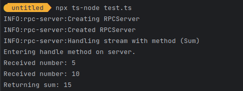
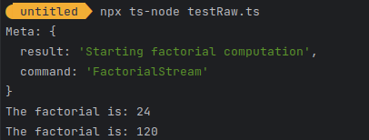
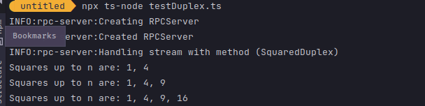
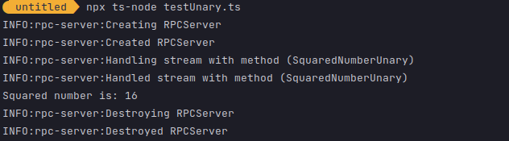

# js-rpc

staging:[](https://gitlab.com/MatrixAI/open-source/js-rpc/commits/staging)
master:[](https://gitlab.com/MatrixAI/open-source/js-rpc/commits/master)

## Installation

```sh
npm install --save @matrixai/rpc
```

## Usage

### Overview of different streams

#### Duplex Stream ->

##### Client:
The client initiates a duplex streaming RPC call using a method that returns both a readable and a writable stream. The client can read from the readable stream and write to the writable stream.

```ts
import { JSONValue } from "./types";
import Caller from './Caller';

// Initialize the duplex call
const { ReadableStream, WritableStream } = client.method();

// Get the reader and writer from the streams
const reader = ReadableStream.getReader();
const writer = WritableStream.getWriter();

// Read output from the server
const readResult = await reader.read();
if (!readResult.done) {
  const output: JSONValue = readResult.value;
  console.log("Received from server:", output);
}

// Write data to the server
const inputData: JSONValue = { someKey: "someValue" };
await writer.write(inputData);

// Don't forget to close the writer when you're done
await writer.close();

```
##### Server :

```ts
import type { ContainerType, JSONValue } from '../types';
import type { ContextTimed } from '@matrixai/contexts';
import Handler from './Handler';

// Define the handler as an async generator function
const handle = async function* (
  input: AsyncIterableIterator<JSONValue>, // This is a generator.
  cancel: (reason?: any) => void,
  meta: Record<string, JSONValue> | undefined,
  ctx: ContextTimed
): AsyncIterableIterator<JSONValue> {

  // Loop through the incoming stream of messages
  for await (const incomingData of input) {
    console.log("Received from client:", incomingData);

    // Perform some operation on the incoming data
    const outputData: JSONValue = { responseKey: "responseValue" };

    // Yield data back to the client
    yield outputData;
    // We yield since stream can contain multiple messages.
  }
};

```
#### Client Streaming

##### Client
The client initiates a client streaming RPC call using a method that returns a writable stream and a promise. The client writes to the writable stream and awaits the output promise to get the response.

```ts
{ output: Promise<JSONValue>, WriteableStream<JSONValue>} = client.method();
    const writer = WritableStream.getWriter();
    writer.write();
    const Output = await output;
```
##### Server
On the server side, the handle function is defined as an asynchronous generator function. It takes an AsyncIterableIterator as input, which represents the stream of incoming messages from the client. It yields output back to the client as needed.
```ts
// Initialize the client streaming call
const { output, writable } = client.method();
const writer = writable.getWriter();

// Write multiple messages to the server
const inputData1: JSONValue = { key1: "value1" };
const inputData2: JSONValue = { key2: "value2" };
await writer.write(inputData1);
await writer.write(inputData2);

// Close the writer when done
await writer.close();

// Wait for the server's response
const serverOutput: JSONValue = await output;
console.log("Received from server:", serverOutput);
```

###### Server
On the server side, the handle function is an asynchronous function that takes an AsyncIterableIterator as input, representing the stream of incoming messages from the client. It returns a promise that resolves to the output that will be sent back to the client.
```ts
import { JSONValue } from "./types";
import type { ContextTimed } from '@matrixai/contexts';

const handle = async (
input: AsyncIterableIterator<JSONValue>,
cancel: (reason?: any) => void,
meta: Record<string, JSONValue> | undefined,
ctx: ContextTimed
): Promise<JSONValue> {

// Aggregate or process the incoming messages from the client
let aggregateData: any = {};  // Replace 'any' with your specific type
for await (const incomingData of input) {
// Perform some aggregation or processing on incomingData
}

// Generate the response to be sent back to the client
const outputData: JSONValue = { responseKey: "responseValue" };

return outputData;
};
```

#### Server Streaming

##### Client

The client initiates a server streaming RPC call using a method that takes input parameters and returns a readable stream. The client writes a single message and then reads multiple messages from the readable stream.
```ts
// Initialize the server streaming call
const readableStream: ReadableStream<JSONValue> = client.method();

const reader = readableStream.getReader();

// Read multiple messages from the server
while (true) {
  const { value, done } = await reader.read();
  if (done) break;

  console.log("Received from server:", value);
}
```
##### Server
On the server side, the handle function is an asynchronous generator function that takes a single input parameter from the client. It yields multiple messages that will be sent back to the client through the readable stream.
```ts
import { JSONValue } from "./types";
import type { ContextTimed } from '@matrixai/contexts';

public handle = async function* (
  input: JSONValue,
  cancel: (reason?: any) => void,
  meta: Record<string, JSONValue> | undefined,
  ctx: ContextTimed
): AsyncIterableIterator<JSONValue> {

  // Process the input and prepare the data to be sent back to the client
  const outputData1: JSONValue = { responseKey1: "responseValue1" };
  const outputData2: JSONValue = { responseKey2: "responseValue2" };

  // Yield multiple messages to be sent to the client
  yield outputData1;
};
```

#### Unary Streaming
In a unary RPC, the client sends a single request to the server and receives a single response back, much like a regular function call.
##### Client
The client initiates a unary RPC call by invoking a method that returns a promise. It passes the required input parameters as arguments to the method. The client then waits for the promise to resolve, receiving the output.
``` ts
import type { JSONValue } from '../types';
import Caller from './Caller';

// Initialize the unary RPC call with input parameters
const promise: Promise<JSONValue> = client.unaryCaller("methodName", { someParam: "someValue" });

// Wait for the response
const output: JSONValue = await promise;
console.log("Received from server:", output);

```

##### Server
```ts
import { JSONValue } from "./types";
import { ContextTimed } from "./contexts";  // Assuming ContextTimed is imported from a module named 'contexts'

public handle = async (
input: JSONValue,
cancel: (reason?: any) => void,
meta: Record<string, JSONValue> | undefined,
ctx: ContextTimed,
): Promise<JSONValue> {

// Process the input and prepare the data to be sent back to the client
const outputData: JSONValue = { responseKey: "responseValue" };

return outputData;
};
```

### Usage Examples

Because decorators are experimental, you must enable:
`"experimentalDecorators": true` in your `tsconfig.json` to use this library.

#### Client Stream
In a Client Stream, the client can write multiple messages to a single stream,
while the server reads from that stream and then returns a single response.
This pattern is useful when the client needs to send a sequence of data to the server,
after which the server processes the data and replies with a single result.
This pattern is good for scenarios like file uploads.

This example shows how to create an RPC pair and handle streaming integers and summing them up.

```ts
import {
    ContainerType,
    JSONValue,
    IdGen,
    StreamFactory,
    MiddlewareFactory, ClientManifest,
} from "@matrixai/rpc/dist/types";
import WebSocket = require('ws');
import {ClientHandler} from "@matrixai/rpc/dist/handlers";
import type { ContextTimed } from '@matrixai/contexts';
import RPCServer from '@matrixai/rpc/dist/RPCServer'
import RPCClient from '@matrixai/rpc/dist/RPCClient'
import Logger, { LogLevel, StreamHandler } from '@matrixai/logger';
import { createDestroy } from '@matrixai/async-init';
import {ClientCaller} from "@matrixai/rpc/dist/callers";
import {ReadableStream, WritableStream} from "stream/web";
import {ReadableStreamDefaultController} from "stream/web";

const logger = new Logger(`RPC Test`, LogLevel.WARN, [new StreamHandler()]);

let streamFactory: StreamFactory;
let middlewareFactory: MiddlewareFactory<any, any, any, any>;
let idGen: IdGen;

class Sum extends ClientHandler<ContainerType, number, number> {
    public handle = async (
        input: AsyncIterable<number>,
    ): Promise<number> => {
        let sum = 0;
        console.log("Entering handle method on server.");
        for await (const num of input) {
            console.log(`Received number: ${num}`);
            sum += num;
        }
        console.log(`Returning sum: ${sum}`);
        return sum;
    };

}

// Server-side WebSocket setup
// Server-side setup
async function startServer() {
  const rpcServer = new RPCServer({
    logger: new Logger('rpc-server'),
    timeoutTime: 60000,
    idGen,
  });

  await rpcServer.start({
    manifest: {
      Sum: new Sum({}),
    },
  });

  // Create synthetic streams here
  const { readable, writable } = createSyntheticStreams();
  rpcServer.handleStream({ readable, writable, cancel: () => {} });

  return { rpcServer };
}

// Create synthetic streams
function createSyntheticStreams() {
  const readable = new ReadableStream();
  const writable = new WritableStream();

  return { readable, writable };
}

type Manifest = {
  Sum: ClientCaller<number, number>;
};
// Client-side WebSocket setup
// Client-side setup
async function startClient() {
  const { readable, writable } = createSyntheticStreams();
  const rpcClient = new RPCClient({
    manifest: {
      Sum: new ClientCaller<number, number>(),
    },
    streamFactory: async () => ({ readable, writable, cancel: () => {} }),
    middlewareFactory,
    logger,
    idGen,
  });

  return rpcClient;
}

// Function to execute the Sum RPC call
async function executeSum(rpcClient: RPCClient<Manifest>) {
    try {
        const { output, writable } = await rpcClient.methods.Sum();
        const writer = writable.getWriter();
        await writer.write(5);
        await writer.write(10);
        await writer.close();

        const ans = await output;
        console.log(`Received output: ${ans}`);
        console.log(`Sum is: ${ans}`);
    } catch (error) {
        console.error("Error in executeSum:", error);
    }
}

// Main function to tie everything together
async function main() {
    try {
        const serverObject = await startServer();
        const rpcClient = await startClient();

        await executeSum(rpcClient);
            await serverObject.rpcServer.destroy();
    } catch (err) {
        console.error("An error occurred:", err);
    }
}

main();
```

#### Raw Stream

Raw Stream is designed for low-level handling of RPC calls, enabling granular control over data streaming.
Unlike other patterns, Raw Streams allow both the server and client to work directly with raw data,
providing a more flexible yet complex way to handle communications.
This is especially useful when the RPC protocol itself needs customization
or when handling different types of data streams within the same connection.

In this example, the client sends a sequence of numbers and the server responds with the factorial of each number.
```ts
import {
ContainerType,
JSONValue,
IdGen,
StreamFactory,
MiddlewareFactory, ClientManifest, JSONRPCRequest,
} from "@matrixai/rpc/dist/types";
import WebSocket = require('ws');
import { RawHandler} from "@matrixai/rpc/dist/handlers";
import type { ContextTimed } from '@matrixai/contexts';
import RPCServer from '@matrixai/rpc/dist/RPCServer'
import RPCClient from '@matrixai/rpc/dist/RPCClient'
import Logger, { LogLevel, StreamHandler } from '@matrixai/logger';
import { createDestroy } from '@matrixai/async-init';
import {RawCaller} from "@matrixai/rpc/dist/callers";
import {ReadableStream, WritableStream} from "stream/web";
import {ReadableStreamDefaultController} from "stream/web";


const logger = new Logger('RPC Test', LogLevel.WARN, [new StreamHandler()]);
let streamFactory: StreamFactory;
let middlewareFactory: MiddlewareFactory<any, any, any, any>;
let idGen: IdGen;

type Manifest = {
FactorialStream: RawCaller;
};

class FactorialStream extends RawHandler<ContainerType> {
  public handle = async (
  [request, inputStream]: [JSONRPCRequest, ReadableStream<Uint8Array>],
  cancel: (reason?: any) => void,
  meta: Record<string, JSONValue> | undefined,
  ctx: ContextTimed
  ): Promise<[JSONValue, ReadableStream<Uint8Array>]> => {
  const { readable, writable } = new TransformStream<Uint8Array, Uint8Array>();
    (async () => {
        const reader = inputStream.getReader();
        const writer = writable.getWriter();
        while (true) {
            const { done, value } = await reader.read();
            if (done) {
                break;
            }

            const num = parseInt(new TextDecoder().decode(value), 10);
            const factorial = factorialOf(num).toString();
            const outputBuffer = new TextEncoder().encode(factorial);

            writer.write(outputBuffer);
        }
        writer.close();
    })();

    return ['Starting factorial computation', readable as ReadableStream<Uint8Array>];
  }
}

function factorialOf(n: number): number {
  return n === 0 ? 1 : n * factorialOf(n - 1);
}

async function startServer() {
  const rpcServer = new RPCServer({
    timeoutTime: 200,
    logger,
    idGen,
  });

  await rpcServer.start({
    manifest: {
      FactorialStream: new FactorialStream({}),
    },
  });

  // Create synthetic streams here
  const { readable, writable } = createSyntheticStreams();
  rpcServer.handleStream({ readable, writable, cancel: () => {} });

  return { rpcServer };
}
// Create synthetic streams
function createSyntheticStreams() {
  const readable = new ReadableStream();
  const writable = new WritableStream();
  return { readable, writable };
}

async function startClient() {
  const { readable, writable } = createSyntheticStreams();
  const rpcClient = new RPCClient({
    manifest: {
      FactorialStream: new RawCaller(),
    },
    streamFactory: async () => ({ readable, writable, cancel: () => {} }),
    middlewareFactory,
    logger,
    idGen,
  });

  return rpcClient;
}

async function execute(rpcClient: RPCClient<Manifest>){
try{
// Initialize the FactorialStream RPC method
const { readable, writable, meta } = await rpcClient.methods.FactorialStream({timer: 200});

        console.log('Meta:', meta); // Output meta information, should be 'Starting factorial computation'

        // Create a writer for the writable stream
        const writer = writable.getWriter();

        // Send numbers 4, 5, 6, 8 to the server for factorial computation
        for (const num of [4, 5, 6, 8]) {
            const buffer = new TextEncoder().encode(num.toString());
            await writer.write(buffer);
        }
        await writer.close();

        // Create a reader for the readable stream
        const reader = readable.getReader();

        // Read the computed factorials from the server
        while (true) {
            const { done, value } = await reader.read();
            if (done) {
              console.log('Done reading from stream.');
              process.exit(0);
              break;
            }
            const factorialResult = new TextDecoder().decode(value).trim();  // Added trim() to remove any extra whitespace
            console.log(`The factorial is: ${factorialResult}`);

        }
    }catch (error){
        console.error("Error is :", error);

    }
}

async function main() {
try {
const serverObject = await startServer();
const rpcClient = await startClient();

        await execute(rpcClient);
            await serverObject.rpcServer.destroy();
    } catch (err) {
        console.error("An error occurred:", err);
    }
}

main();
```

#### Server Stream
In Server Stream calls,
the client sends a single request and receives multiple responses in a read-only stream from the server.
The server can keep pushing messages as long as it needs, allowing real-time updates from the server to the client.
This is useful for things like monitoring,
where the server needs to update the client in real-time based on events or data changes.
In this example, the client sends a number and the server responds with the squares of all numbers up to that number.

```ts
import Logger, {LogLevel, StreamHandler} from "@matrixai/logger";
import {ContainerType, IdGen, JSONValue, MiddlewareFactory, StreamFactory} from "@matrixai/rpc/dist/types";
import {RawCaller, ServerCaller} from "@matrixai/rpc/dist/callers";
import {ServerHandler} from "@matrixai/rpc/dist/handlers";
import {ContextTimed} from "@matrixai/contexts";
import RPCServer from "@matrixai/rpc/dist/RPCServer";
import WebSocket = require('ws');
import {ReadableStream, ReadableStreamDefaultController, WritableStream} from "stream/web";
import RPCClient from "@matrixai/rpc/dist/RPCClient";

const logger = new Logger('Server Test', LogLevel.WARN, [new StreamHandler()]);
let streamFactory: StreamFactory;
let middlewareFactory: MiddlewareFactory<any, any, any, any>;
let idGen: IdGen;

class SquaredNumbers extends ServerHandler<ContainerType, number, number>{
  public handle = async function* (
  input: number,
  ):AsyncGenerator<number>{
    for (let i = 0; i<= input; i++){
      yield i*i;
    }
  };
}
type Manifest = {
  SquaredNumbers: ServerCaller<number,number>;
}
// Create synthetic streams
function createSyntheticStreams() {
  const readable = new ReadableStream();
  const writable = new WritableStream();
  return { readable, writable };
}

async function startServer() {
  const rpcServer = new RPCServer({
    logger,
    idGen,
  });
  await rpcServer.start({
    manifest: {
      SquaredNumbers: new SquaredNumbers({}),
    },
  });

  const { readable, writable } = createSyntheticStreams();
  rpcServer.handleStream({ readable, writable, cancel: () => {} });

  return { rpcServer };
}

async function startClient() {
  return new Promise<RPCClient<Manifest>>((resolve, reject) => {
    const { readable, writable } = createSyntheticStreams();
    const rpcClient = new RPCClient<Manifest>({
      manifest: {
        SquaredNumbers: new ServerCaller<number, number>(),
      },
      streamFactory: async () => ({ readable, writable, cancel: () => {} }),
      middlewareFactory,
      logger,
      idGen,
    });
    resolve(rpcClient);
  });
}

async function execute(rpcClient: RPCClient<Manifest>) {
try {
const squaredStream = await rpcClient.methods.SquaredNumbers(235);
const outputs: Array<number> = [];
for await(const num of squaredStream) {
outputs.push(num);
}
console.log(`Squared numbers are: ${outputs.join(', ')}`);
} catch (error) {
console.error("Error in execute:", error);
}
}


async function main() {
try {
const serverObject = await startServer();
const rpcClient = await startClient();

        await execute(rpcClient);

        await serverObject.rpcServer.destroy();
    } catch (err) {
        console.log('An Error occurred: ', err)
    }
}


main();
```
#### Duplex Stream
A Duplex Stream enables both the client and the server to read
and write messages in their respective streams independently of each other.
Both parties can read and write multiple messages in any order.
It's useful in scenarios that require ongoing communication in both directions, like chat applications.

In this example, the client sends a sequence of numbers and the server responds with the squares of those numbers.
```ts
import Logger, {LogLevel, StreamHandler} from "@matrixai/logger";
import {ContainerType, IdGen, JSONValue, MiddlewareFactory, StreamFactory} from "@matrixai/rpc/dist/types";
import {defaultMiddleware} from "@matrixai/rpc/dist/middleware";
import {ClientCaller, DuplexCaller} from "@matrixai/rpc/dist/callers";
import {DuplexHandler} from "@matrixai/rpc/dist/handlers";
import {ContextTimed} from "@matrixai/contexts";
import RPCServer from "@matrixai/rpc/dist/RPCServer";
import WebSocket = require('ws');
import {takeUntil} from "ix/Ix.dom.asynciterable.operators";
import RPCClient from "@matrixai/rpc/dist/RPCClient";
import {ReadableStream, ReadableStreamDefaultController, WritableStream} from "stream/web";


const logger = new Logger('Duplex Test', LogLevel.WARN, [new StreamHandler()]);

let streamFactory: StreamFactory;
let middlewareFactory: MiddlewareFactory<any, any, any, any>;
let idGen: IdGen;

class SquaredDuplex extends DuplexHandler<ContainerType, number, Array<number>>{
  public handle = async function*(
    input: AsyncIterableIterator<number>,
    cancel: (reason?: any) => void,
    meta: Record<string, JSONValue> | undefined,
    ctx: ContextTimed,
  ): AsyncIterableIterator<Array<number>>{
    for await (const num of input){
      const squares: Array<number> = []
      for(let i =1; i<=num; i++){
        squares.push(i*i);
      }
      yield squares;
    }
  };
}

type Manifest = {
  SquaredDuplex: DuplexCaller<number, Array<number>>;
};

async function startServer() {
  const wss = new WebSocket.Server({ port: 8080 });
  const rpcServer = new RPCServer({
    logger: new Logger('rpc-server'),
    timeoutTime: 1000,
    idGen,
  });
  rpcServer.start({
    manifest: {
      SquaredDuplex: new SquaredDuplex({}),
    },
  });

  wss.on('connection', (ws) => {
    const { readable, writable } = wsToStream(ws);
    rpcServer.handleStream({ readable, writable, cancel: () => {} });
  });
  return { rpcServer  };
}

async function startClient() {
  return new Promise<RPCClient<Manifest>>( (resolve, reject) => {
    const ws = new WebSocket('ws://localhost:8080');

    ws.addEventListener('open', async () => {
      const { readable, writable } = wsToStream(ws);
      const rpcClient = new RPCClient({
        manifest: {
          SquaredDuplex: new DuplexCaller<number, Array<number>>(),
        },
        streamFactory: async () => ({ readable, writable, cancel: () => {} }),
        middlewareFactory,
        logger,
        idGen,
      });
      resolve(rpcClient);
    });

    ws.addEventListener('error', (err) => {
      reject(err);
    });
  });
}
function wsToStream(ws: WebSocket): { readable: ReadableStream, writable: WritableStream } {
  let readableController: ReadableStreamDefaultController<any> | null = null;

  const readable = new ReadableStream({
    start(controller) {
      readableController = controller;
    },
    cancel() {
      ws.close();
    },
  });

  ws.on('message', (chunk: any) => {
    readableController?.enqueue(chunk);
  });

  ws.on('close', () => {
    readableController?.close();
  });

  const writable = new WritableStream({
    write(chunk) {
      ws.send(chunk);
    },
    close() {
      ws.close();
    },
    abort() {
      ws.close();
    },
  });

  return { readable, writable };
}

// Client-side duplex caller
async function executeSquareNumbersDuplex(rpcClient: RPCClient<Manifest>) {

  try{const { readable, writable } = await rpcClient.methods.SquaredDuplex();
    const writer = writable.getWriter();
    await writer.write(2);
    await writer.write(3);
    await writer.write(4);

    // Read squared numbers from the server
    for await (const squares of readable) {
      console.log(`Squares up to n are: ${squares.join(", ")}`);
    }
    await writer.close();

  }catch (e){
    console.log(e)
  }
}

// Main function to tie everything together
async function main() {
  try {
    const serverObject = await startServer();
    const rpcClient = await startClient();

    await executeSquareNumbersDuplex(rpcClient);  // Add this line to run the duplex caller
    await serverObject.rpcServer.destroy();
  } catch (err) {
    console.error("An error occurred:", err);
  }
}

main();

```

#### Unary Stream

In a Unary Stream, the client sends a single request to the server and gets a single response back,
just like HTTP/REST calls but over a connection.
It's the simplest form of RPC, suitable for short-lived operations that don't require streaming data.
It's the go-to choice for straightforward "request and response" interactions.

In this example, the client sends a number and the server responds with the square of that number.
```ts
import {
  ContainerType,
  JSONValue,
  IdGen,
  StreamFactory,
  MiddlewareFactory, ClientManifest,
} from "@matrixai/rpc/dist/types";
import WebSocket = require('ws');
import {ClientHandler, UnaryHandler} from "@matrixai/rpc/dist/handlers";
import type { ContextTimed } from '@matrixai/contexts';
import RPCServer from '@matrixai/rpc/dist/RPCServer'
import RPCClient from '@matrixai/rpc/dist/RPCClient'
import Logger, { LogLevel, StreamHandler } from '@matrixai/logger';
import { createDestroy } from '@matrixai/async-init';
import {ClientCaller, UnaryCaller} from "@matrixai/rpc/dist/callers";
import {ReadableStream, WritableStream} from "stream/web";
import {ReadableStreamDefaultController} from "stream/web";

const logger = new Logger(`RPC Test`, LogLevel.WARN, [new StreamHandler()]);

let streamFactory: StreamFactory;
let middlewareFactory: MiddlewareFactory<any, any, any, any>;
let idGen: IdGen;

class SquaredNumberUnary extends UnaryHandler<ContainerType, number, number> {
  public handle = async (
    input: number,
    cancel: (reason?: any) => void,
    meta: Record<string, JSONValue> | undefined,
    ctx: ContextTimed,
  ): Promise<number> => {
    return input * input;
  };
}
// Create synthetic streams
function createSyntheticStreams() {
  const readable = new ReadableStream();
  const writable = new WritableStream();
  return { readable, writable };
}
// Server-side setup
async function startServer() {
  const rpcServer = new RPCServer({
    logger: new Logger('rpc-server'),
    timeoutTime: 1000,
    idGen,
  });

  await rpcServer.start({
    manifest: {
      SquaredDuplex: new SquaredDuplex({}),
    },
  });

  // Replace WebSocket with synthetic stream
  const { readable, writable } = createSyntheticStreams();
  rpcServer.handleStream({ readable, writable, cancel: () => {} });

  return { rpcServer };
}
// Client-side setup
async function startClient() {
  return new Promise<RPCClient<Manifest>>((resolve, reject) => {
    const { readable, writable } = createSyntheticStreams();
    const rpcClient = new RPCClient({
      manifest: {
        SquaredDuplex: new DuplexCaller<number, Array<number>>(),
      },
      streamFactory: async () => ({ readable, writable, cancel: () => {} }),
      middlewareFactory,
      logger,
      idGen,
    });
    resolve(rpcClient);
  });
}

// Function to execute the Sum RPC call
async function executeSquare(rpcClient: RPCClient<Manifest>) {
  try {
    // Sending a number (e.g., 4) to be squared
    const squaredNumber = await rpcClient.methods.SquaredNumberUnary(4);

    // Log the squared number
    console.log(`Squared number is: ${squaredNumber}`);
  } catch (error) {
    // Handle any errors
    console.error(`An error occurred while executing SquaredNumberUnary: ${error}`);
  }
}

// Main function to tie everything together
async function main() {
  try {
    const serverObject = await startServer();
    const rpcClient = await startClient();

    await executeSquare(rpcClient);
    await serverObject.rpcServer.destroy();
  } catch (err) {
    console.error("An error occurred:", err);
  }
}

main();

```


## Specifications

### Throwing Timeouts

By default, a timeout will not cause an RPC call to automatically throw, this must be manually done by the handler when it receives the abort signal from `ctx.signal`. An example of this is like so:

```ts
class TestMethod extends UnaryHandler {
  public handle = async (
    input: JSONValue,
    cancel: (reason?: any) => void,
    meta: Record<string, JSONValue> | undefined,
    ctx: ContextTimed,
  ): Promise<JSONValue> => {
    const abortProm = utils.promise<never>();
    ctx.signal.addEventListener('abort', () => {
      resolveCtxP(ctx);
      abortProm.resolveP(ctx.signal.reason);
    });
    throw await abortProm.p;
  };
}
```

### Timeout Priority

A `timeoutTime` can be passed both to the constructors of `RPCServer` and `RPCClient`. This is the default `timeoutTime` for all callers/handlers.

In the case of `RPCServer`, a `timeout` can be specified when extending any `Handler` class. This will override the default `timeoutTime` set on `RPCServer` for that handler only.

```ts
class TestMethodArbitraryTimeout extends UnaryHandler {
  public timeout = 100;
  public handle = async (
    input: JSONValue,
    _cancel,
    _meta,
    ctx_,
  ): Promise<JSONValue> => {
    return input;
  };
}
```

In the case of `RPCClient`, a `ctx` with the property `timer` can be supplied with a `Timer` instance or `number` when making making an RPC call. This will override the default `timeoutTime` set on `RPCClient` for that call only.

```ts
await rpcClient.methods.testMethod({}, { timer: 100 });
await rpcClient.methods.testMethod({}, { timer: new Timer(undefined, 100) });
```

It's important to note that any of these timeouts will ultimately be overridden by the shortest timeout of the server and client combined using the timeout middleware below.

### Timeout Middleware

The `timeoutMiddleware` sets an RPCServer's timeout based on the lowest timeout between the Client and the Server. This is so that handlers can eagerly time out and stop processing as soon as it is known that the client has timed out.

This case can be seen in the first diagram, where the server is able to stop the processing of the handler, and close the associated stream of the RPC call based on the shorter timeout sent by the client:


Where the `RPCClient` sends a timeout that is longer than that set on the `RPCServer`, it will be rejected. This is as the timeout of the client should never be expected to exceed that of the server, so that the server's timeout is an absolute limit.


The `timeoutMiddleware` is enabled by default, and uses the `.metadata.timeout` property on a JSON-RPC request object for the client to send it's timeout.

## Development

Run `nix-shell`, and once you're inside, you can use:

```sh
# install (or reinstall packages from package.json)
npm install
# build the dist
npm run build
# run the repl (this allows you to import from ./src)
npm run ts-node
# run the tests
npm run test
# lint the source code
npm run lint
# automatically fix the source
npm run lintfix
```

### Docs Generation

```sh
npm run docs
```

See the docs at: https://matrixai.github.io/js-rpc/

### Publishing

Publishing is handled automatically by the staging pipeline.

Prerelease:

```sh
# npm login
npm version prepatch --preid alpha # premajor/preminor/prepatch
git push --follow-tags
```

Release:

```sh
# npm login
npm version patch # major/minor/patch
git push --follow-tags
```

Manually:

```sh
# npm login
npm version patch # major/minor/patch
npm run build
npm publish --access public
git push
git push --tags
```

Domains Diagram:

